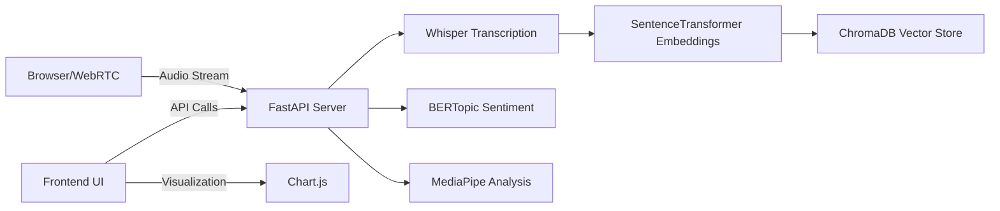

# Memori: Intelligent Audio Memory System

> **Note:** This project is part of a master's thesis at Harvard MDE (Master in Design Engineering).

<div align="center">


[](./BACKEND_TESTING_COMPLETE.md)
[](./FRONTEND_TESTING_COMPLETE.md)

*An advanced AI-powered audio memory system that transcribes, analyzes, and makes your audio memories searchable and explorable.*

</div>

## Overview

**Memori** is an AI-powered audio memory system that transforms spoken conversations into searchable, data-rich memories. Developed as part of a Master’s thesis at Harvard MDE, it captures real-time audio, transcribes it with high accuracy, analyzes emotional and non-verbal cues, and stores everything in a vector database for intuitive retrieval and exploration.

## Key Features

- **High-Accuracy Transcription**  
  Utilizes OpenAI’s Whisper model for precise, real-time speech-to-text.

- **Semantic Search**  
  Embeds transcripts with SentenceTransformers and stores embeddings in ChromaDB for vector-based similarity and semantic queries.

- **Multimodal Emotion Analysis**  
  Leverages BERTopic to extract emotional tone from speech and MediaPipe to analyze body language, enriching each memory with contextual metadata.

- **Real-Time Processing**  
  Streams audio, transcribes, analyzes, and visualizes results instantly for seamless user interaction.

- **Interactive Analytics**  
  Generates dynamic charts and insights via Chart.js to help users explore patterns and sentiments in their conversations.

## Tech Stack

- **Backend:** FastAPI (Python) with JWT-based authentication for secure API endpoints and task orchestration.
- **Frontend:** Vanilla JavaScript, Tailwind CSS, WebRTC for audio capture, and Chart.js for visualizations.
- **AI Models:** Whisper (speech recognition), SentenceTransformers (embeddings), BERTopic (topic & sentiment clustering), MediaPipe (body language/gesture detection), ChromaDB (vector storage).
- **Deployment:** Docker & Docker Compose for portable, cloud- or on-premises deployments (AWS, GCP, Azure).

## Innovation

Memori pioneers a unified, multimodal AI approach by combining audio transcription, emotion analysis, and non-verbal behavior detection into a single system. Its vector-based search enables natural-language and similarity-driven memory retrieval, a capability rare in personal or research-oriented audio platforms.

## Use Cases

- **Personal Journaling:** Capture and reflect on daily conversations, extracting emotional and contextual insights.
- **Research:** Analyze spoken and non-verbal data for sociolinguistics, psychology, or human-computer interaction studies.
- **Creative & Therapeutic Apps:** Build interactive storytelling experiences or therapeutic tools that respond to users’ emotional and behavioral cues.

## Architecture Overview



## Getting Started

1. **Clone the Repository**

   ```bash
   git clone https://github.com/akalem0808/memori.git
   cd memori
   ```
2. **Configure Environment**  
   Copy `.env.example` to `.env` and set `SECRET_KEY`, `DATABASE_URL`, and `ALLOWED_ORIGINS`.
3. **Build & Run**

   ```bash
   docker-compose up --build
   ```
4. **Access**

   - Frontend: [http://localhost:8080](http://localhost:8080)
   - API: [http://localhost:8000/docs](http://localhost:8000/docs)

## API Reference

| Endpoint             | Method | Description                                     |
|----------------------|--------|-------------------------------------------------|
| /auth/login          | POST   | Obtain JWT token                                |
| /memories/audio      | POST   | Upload raw audio for transcription and analysis |
| /memories            | GET    | Retrieve transcription results                  |
| /memories/search     | POST   | Perform semantic search over stored memories    |
| /analytics           | GET    | Fetch sentiment and analysis data               |

## Roadmap & Future Work

- **v0.2:** Multi-speaker diarization, custom emotion models
- **v1.0:** Native mobile app, plugin architecture for custom AI modules
- **Long Term:** Real-time group meeting summaries, calendar/task integration

## Contribution Guidelines

- Fork the repo and create feature branches named `feature/your-feature`.
- Write tests with pytest and ensure coverage.
- Run code style checks: `black . && flake8`.
- Submit pull requests against the `main` branch referencing issues.

## Testing & CI/CD

- **Tests:** `pytest --cov=app`
- **Linting:** `flake8`
- **CI:** GitHub Actions runs tests and builds Docker images on PRs.

## Privacy & Security

- **JWT Authentication** for all API calls.
- **CORS Restrictions** limit allowed origins.
- **Input Validation** with Pydantic prevents injection.
- **Rate Limiting** protects against abuse.

## Limitations & Known Issues

- Maximum audio clip length: 5 minutes.
- Emotion analysis may misclassify subtle tones.
- Large-scale deployments might require database sharding.

## Acknowledgments & Credits

- Inspiration: Memex, Otter.ai

## Community & Support

- **Discussions:** GitHub Discussions
- **Chat:** Slack (link in README)
- **Issues:** GitHub Issues

---

**License:** MIT

*Memori is open for collaboration—your contributions and feedback are welcome!*